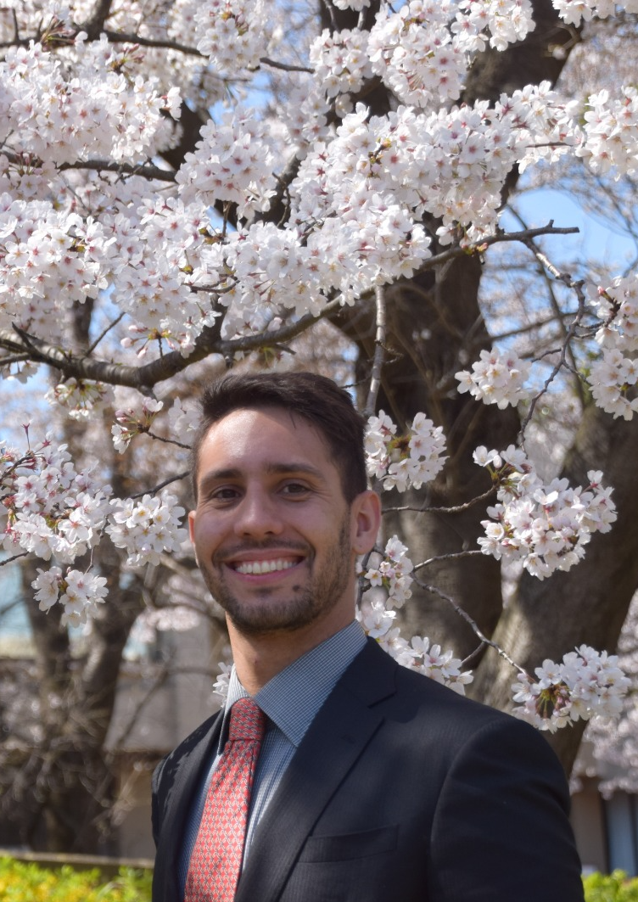

I’m a PhD candidate, second year, at the University of Tsukuba, Japan. My research interests are related to Computational Intelligence, such as Evolutionary Computation and Artificial Life, especially Evolutionary Algorithms (EC), with a recent focus on multi-objective optimization. I’m engaged in cooperating in projects for using EC as a tool to solve problems in any field.

EC are heuristics based on ideas from biological evolution. The goal of EC is to learn solutions to challenging computational problems using ideas taken from the evolutionary process. EC can solve a few examples of problems: parameter optimization, product design, expert systems design, linear and non-linear regression, and automated control.

Specialties: Genetic Algorithms, Artificial Intelligence, Evolutionary Computation, and Artificial Life. 

### General Information
- Check my [Publication List.](https://yurilavinas.github.io/publications.html)
- I am part of the [**Autoadaptation in Multi-Objective Optimization**](http://conclave.cs.tsukuba.ac.jp/research/autoadapt/) group, under Prof. Claus Aranha supervision.

### Follow me

- Talk to me on [Twitter](https://twitter.com/yurilavinas).

- Find my papers in my [Google Scholar profile](https://scholar.google.com/citations?user=-hdeQYcAAAAJ&hl=en&oi=ao) or in my [ResearchGate profile](https://www.researchgate.net/profile/Yuri_Lavinas).

- Most of my projects are on [Github](https://github.com/yurilavinas).

- Send me an [e-mail](mailto:lavinas.yuri.xp@alumni.tsukuba.ac.jp). You can also find my contact information at the top of the page.

 
 

