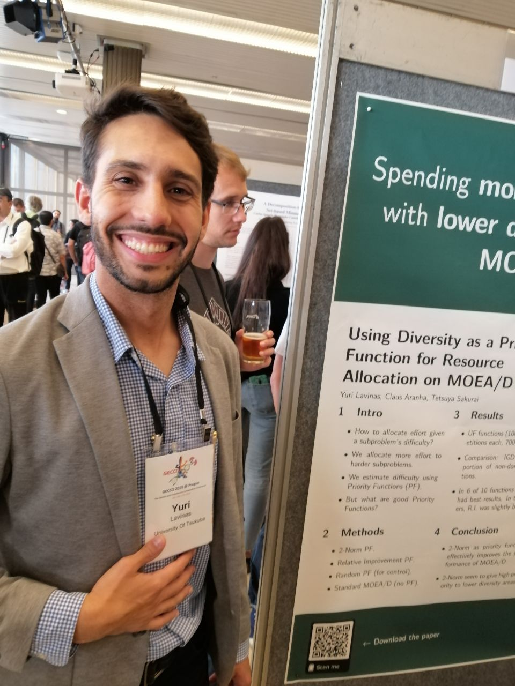

 

# About me

Currently, I'm a PhD student, first year, at the University of Tsukuba. I am very excited about any topic related to Artificial Intelligence, Evolutionary Computation, neuro-evolution and Artificial Life. My master research topic include refining Resource Allocation on the fly on MOEA/D and Parameter Analysis, which I am currently expading by analysing a component-wise approach for Resource Allocation in MOEA/D in parallel.

- Check my [Publication List](https://yclavinas.github.io/publications.html)
Send me an [e-mail](mailto:lavinas.yuri.xp@alumni.tsukuba.ac.jp). You can find my contact information at the top of the page.

## Summary of Research Projects

### MOEA/D and Resource Allocation

The Multi-Objective Evolutionary Algorithm Based on Decomposition (MOEA/D) generally is considered an effective algorithm for solving MOPs. The key idea of the MOEA/D is to decompose the multiple objectives into a large number of single-objective subproblems, and then solving these subproblems in by a population-based evolutionary approach. It has since become clear that focusing computational effort on certain subsets of these subproblems can substantially improve the performance of MOEA/D, for which, Resource Allocation techniques are used for consistently improve the performance of MOEA/D. 

1. What should be the criteria for allocating more computational effort on one problem or another? Convergence? Diversity? Robustness? 
2. What are the components of MOEA/D that show better synergy with the Resource Allocation techniques? Decomposition techniques? Number of sub-problems?

### Human-Computer Collaboration for the Generation of Soccer Strategies using Multi-Agent Simulations

How close are football (soccer) video games similar to real life football matches? What real games can learn from video games? What video games can learn from real games? Which aspects do they share and which they do not? Our group is focusing on answering these questions, by comparing video games matches with data from real matches in Brazil.

Ongoing work refers to deepening our understanding regarding the different simulation variations, aiming to address the following research questions:

1. How to "calibrate" simulated matches in order to properly handle sampling issues and interruptions?
2. How do different simulations differ from each other?
3. Which kinds of simulated matches are more similar to professional matches?
4. Which kinds of simulated matches better encode intrinsic tactical relationships (coordination) between teams?
