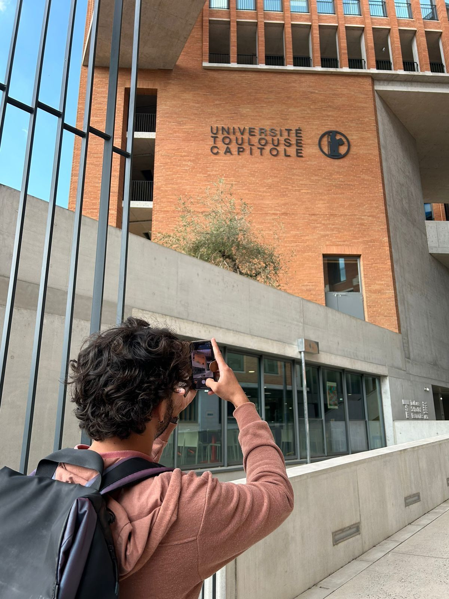

<!-- I'm currently an Assistant Professor in the Department of Computer Science [(CIC)](https://cic.unb.br/), at the University of Brasília [(UnB)](https://unb.br/).  -->
From 2024 to 2026, I was a [***maître de conférences***](https://en.wikipedia.org/wiki/Academic_ranks_in_France) at the University [Toulouse Capitole](https://www.ut-capitole.fr/), France, at the Institut de Recherche en Informatique de Toulouse, [(IRIT)](https://www.ut-capitole.fr/accueil/recherche/equipes-et-structures/institut-de-recherche-en-informatique-de-toulouse-irit), and part of the [REVA team](https://www.irit.fr/en/departement/dep-hpc-simulation-optimization/reva-team/). 

I did a 18 month-long postdoc research working with histopathology image analysis for cancer treatment with Genetic Programming in the [IRIT@CRCT](https://www.crct-inserm.fr/iritcrct/) group, a joint laboratory between the Cancer Research Center of Toulouse [CRCT](https://www.crct-inserm.fr/en/) and IRIT, together with prof. [Sylvain Cussat-Blanc](https://www.irit.fr/~Sylvain.Cussat-Blanc/index_en.php). 

I got my PhD degree from the University of Tsukuba, Japan. I was part of the [**Autoadaptation in Multi-Objective Optimization**](http://conclave.cs.tsukuba.ac.jp/research/autoadapt/) group, under Prof. [Claus Aranha](https://conclave.cs.tsukuba.ac.jp/about/) supervision. I obtained my bachelor’s degree in Computer Science from UnB in 2016, where I was supervised by prof. [Marcelo Ladeira](https://cic.unb.br/professores/92-mladeira).

My research interests are related to Computational Intelligence, such as Evolutionary Computation and Artificial Life, with a greater focus on multi-objective optimization and Genetic Programming. Overall, I'm interested in programs that can adapt themselves, in applications of Evolutionary Computation (interpretability, biomedical data, games), as well as more speculative use of these Computational Intelligence for Artificial Life (such as the evolution of virtual creatures and the worlds where the live).

### General Information
- Check my [Publication List.](https://yurilavinas.github.io/publications.html)

- Find my papers in my [Google Scholar profile](https://scholar.google.com/citations?user=-hdeQYcAAAAJ&hl=en&oi=ao) or in my [ResearchGate profile](https://www.researchgate.net/profile/Yuri_Lavinas).

- Most of my projects are on [Github](https://github.com/yurilavinas).

- Send me an [e-mail](mailto:lavinas.yuri.xp@alumni.tsukuba.ac.jp). You can also find my contact information at the top-right of the page.

### Scholarships 

  1. Awarded PhD scholarship by
    - MEXT - 文部科学省奨学金, 2020.04 until 2023.03
  2. Awarded masters scholarship by
    - MEXT - 文部科学省奨学金, 2018.04 until 2020.03
  3. Awarded research scholarship by
    - MEXT - 文部科学省奨学金, 2017.09 until 2018.03
  4. Awarded research scholarship by CNPq – National Council for Scientific and Technological Development, 2015.08 until 2016.07.
  5. Awarded research scholarship by CAPES - Coordination for the Improvement of Higher Education Personnel, 2014.08 until 2015.08.
  6. Awarded research scholarship by CNPq - National Council for Scientific and Technological Development, 2014.08 until 2015.07.
    
------

 
 

