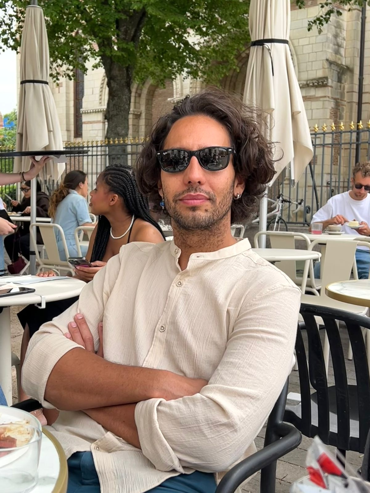

I'm an associate professor at the University of Toulouse 1 Capitole, France and I'm on the [REVA team](https://www.irit.fr/en/departement/dep-hpc-simulation-optimization/reva-team/). I did a postdoc research working with histopathology image analysis for cancer treatment with Genetic Programming in the [IRIT@CRCT](https://www.crct-inserm.fr/iritcrct/) group. I got my PhD degree from the University of Tsukuba, Japan. Originally, I'm from Brazil, where I did my undergraduate course, at the University of Brasilia. 

My research interests are related to Computational Intelligence, such as Evolutionary Computation and Artificial Life, with a greater focus on multi-objective optimization, fitness landscape and  Genetic Programming. Overall, I'm interested in programs that can adapt themselves, in applications of Evolutionary Computation (black box optimization, multi-agent systems, games), as well as more speculative use of these Computational Intelligence for Artificial Life ( such as the evolution of virtual creatures and the worlds where the live).

### General Information
- Check my [Publication List.](https://yurilavinas.github.io/publications.html)
- I was part of the [**Autoadaptation in Multi-Objective Optimization**](http://conclave.cs.tsukuba.ac.jp/research/autoadapt/) group, under Prof. Claus Aranha supervision.

### Follow me

- Talk to me on [Twitter](https://twitter.com/yurilavinas).

- Find my papers in my [Google Scholar profile](https://scholar.google.com/citations?user=-hdeQYcAAAAJ&hl=en&oi=ao) or in my [ResearchGate profile](https://www.researchgate.net/profile/Yuri_Lavinas).

- Most of my projects are on [Github](https://github.com/yurilavinas).

- Send me an [e-mail](mailto:lavinas.yuri.xp@alumni.tsukuba.ac.jp). You can also find my contact information at the top of the page.

### Scholarships 

  1. Awarded PhD scholarship by
    - MEXT - 文部科学省奨学金, 2020.04 until 2023.03
  2. Awarded masters scholarship by
    - MEXT - 文部科学省奨学金, 2018.04 until 2020.03
  3. Awarded research scholarship by
    - MEXT - 文部科学省奨学金, 2017.09 until 2018.03
  4. Awarded research scholarship by CNPq – National Council for Scientific and Technological Development, 2015.08 until 2016.07.
  5. Awarded research scholarship by CAPES - Coordination for the Improvement of Higher Education Personnel, 2014.08 until 2015.08.
  6. Awarded research scholarship by CNPq - National Council for Scientific and Technological Development, 2014.08 until 2015.07.
    
------

 
 

