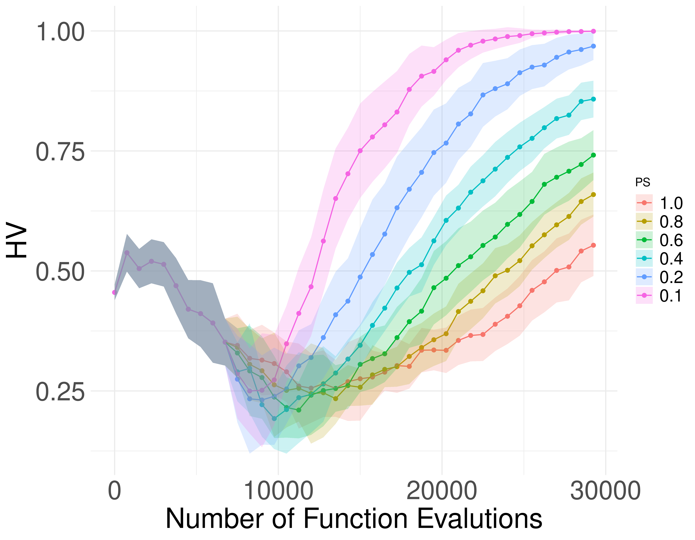

# MOEA/D and Resource Allocation

Multi objective optimization algorithms (MOP solvers) are hard problems, since finding the best solutions for multi-objective problems can be very computationally expensive. One common approach that MOP solvers use when trying to solve MOP is to decompose the MOP into many subproblems. In general, those MOP solvers give the same computational effort to them all. This has some drawbacks: (1) Some subproblems are harder than others, thus the MOP solver requires more computational effort to find better solutions; (2) The MOP solvers might waste computational effort improving solutions that require much effort to improve.

To minimize the effect of these drawbacks, I focus my research on: 1) minimizing computational effort on multi-objective optimization algorithms and 2) improving the performance of multi objective optimization algorithms (MOP solvers) by making them adapt to the characteristics of the problems. 

I studied methods to guide the distribution of computational effort adaptatively in a based-on information the features of the MOP, using priority functions. I proposed different priority functions that allow MOEA/D to explore better the search space, thus MOEA/D can find different and better solutions more efficiently. I observed that MOEA/D improves its performance when only a subset of the solution set is updated on each iteration. 

<!-- {#id .class width=100% height=100%} -->

I am studying in details what are the reasons for the improvement in performance in MOEA/D with priority functions to specify a theoretical justification for the efficacy of MOEA/D with priority functions, careful examining MOEA/D relates to important issues, such as the ability to find solutions closer to the optima and the ability to find different near-optimal solution. To improve our understand of MOEA/D I am studying which components interact well with priority functions to provide a recommendation of MOEA/D component configuration for the community. This will be achieved by a comprehensive and systematic anytime analysis conducted on the combined effect of components, MOEA/D and priority functions. 

<!-- 
 -->

<!-- 
 -->

# Human-Computer Collaboration for the Generation of Soccer Strategies using Multi-AgentSimulations

This project proposes the simulation of football players and games, using Multi-AgentSystem technologies and based on the graph models developed. The Multi-Agent Simulation will allow the visualization, validation, and explorationof the football player models, leading to a greater understanding of the relationship between themodels and the real world data, and extrapolations of many different scenarios using the rulesderived from the models.

The resulting simulator will also be used to help coach and educators. The simulator will assistthem with planning and decision making, by giving these professionals the tools to simulate fictionalscenarios in the simulation and observer how these scenarios play out. The simulator will also allowthese professionals to obtain easily understandable outputs from the model in the form of videosof games between simulated agents, leading to an interactive process of trial, error and discovery.

![Example of a real output of a game where 1 player is controlled by a artificial NeuralNetwork using the Proximal Policy Optimization[^1]](imgs/2D_representation_video.png)

Preliminary results are very promising and achieved results are expected to be of interest for bothsimulator developers and those interested in improving team and player performance based onsimulated data. 

Ongoing work refers to deepening our understanding regarding the different simulation variations, aiming to address the following research questions:

1. How to "calibrate" simulated matches in order to properly handle sampling issues and interruptions?
2. How do different simulations differ from each other?
3. Which kinds of simulated matches are more similar to professional matches?
4. Which kinds of simulated matches better encode intrinsic tactical relationships (coordination) between teams?
<!-- 
 -->

<!-- 
 -->

# Collaboration

Current active collaborations:

1. With the **University of Brasilia**, with Prof. Marcelo Ladeira. 
2. With the **Univeristy of Lille**, with Geoffrey Pruvost together with Profs Bilel Derbel and Arnaud Liefooghe.
3. With the **Univeristy of Norwegian University of Science and Technology**, with Prof. Ricardo Torres, **Londrina State University**, with Prof. Felipe Moura and **Univeristy of Campinas**, with Prof. Sergio Moura.

and I'm looking foward to more!

[^1]:
  John Schulman, Filip Wolski, Prafulla Dhariwal, Alec Radford, and Oleg Klimov.  Proximalpolicy optimization algorithms.arXiv preprint arXiv:1707.06347, 2017.