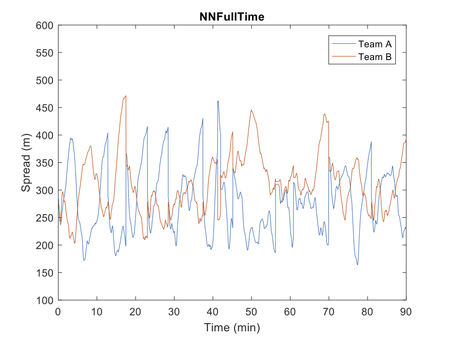

My research interests are Evolutionary Computation, neuro-evolution and Artificial Life. 

That said, until now, most of my publications are limited to Single/Multi Evolutionary Computation.

- For more information, check my [publication list](https://yurilavinas.github.io/publications.html) or send me an [e-mail](mailto:lavinas.yuri.xp@alumni.tsukuba.ac.jp).

### Summary of the projects {.tabset .tabset-pills}

#### MOEA/D and Partial Update of the Population 

Summary of the following works:

1. **Yuri Lavinas**, C. Aranha, M. Ladeira and F. Campelo, "MOEA/D with Random Partial Update Strategy," 2020 IEEE Congress on Evolutionary Computation (CEC), Glasgow, United Kingdom, 2020, pp. 1-8, doi: https://doi.org/10.1109/CEC48606.2020.9185527. [Preprint.](https://arxiv.org/abs/2001.06980)
2. **Yuri Lavinas**, Claus Aranha, Testuya Sakurai, "Using Diversity as a Priority Function for Resource Allocation on MOEA/D", In Genetic and Evolutionary Computation Conference Companion (GECCO '19 Companion), https://doi.org/10.1145/3319619.3321948, 2019.7 [Preprint.](https://dl.acm.org/doi/pdf/10.1145/3319619.3321948)

3. **Yuri Lavinas**, Claus Aranha, and Marcelo Ladeira. "Improving resource allocation in MOEA/D with decision-space diversity metrics". In Theory and Practice of Natural Computing, pp. 134–146, Cham, 2019. Springer International Publishing, https://www.doi.org/10.1007/978-3-030-34500-6_9, 2019.12 [Preprint.](https://link.springer.com/chapter/10.1007%2F978-3-030-34500-6_9)

Multi-objective optimization algorithms (MOP solvers) are hard problems, since finding the best solutions for multi-objective problems can be very computationally expensive. One common approach that MOP solvers use when trying to solve MOP is to decompose the MOP into many subproblems. In general, those MOP solvers give the same computational effort to them all. This has some drawbacks: 

  1. Some subproblems are harder than others; thus, the MOP solver requires more computational effort to find better solutions; 
  2. The MOP solvers might waste computational effort improving solutions that require much effort to improve.

To minimize the effect of these drawbacks, I focus my research on

  - minimizing computational effort on multi-objective optimization algorithms and 
  - improving the performance of multi-objective optimization algorithms (MOP solvers) by making them adapt to the characteristics of the problems. 

I studied methods to guide the distribution of computational effort adaptatively in based-on information on the features of the MOP, using priority functions. I proposed different priority functions that allow MOEA/D to explore better the search space; thus, MOEA/D can find different and better solutions more efficiently. I observed that MOEA/D improves its performance when only a subset of the solution set is updated on each iteration. 

I am studying in details what are the reasons for the improvement in performance in MOEA/D with priority functions to specify a theoretical justification for the efficacy of MOEA/D with priority functions, careful examining MOEA/D relates to important issues, such as the ability to find solutions closer to the optima and the ability to find different near-optimal solutions. To improve our understanding of MOEA/D I am studying which components interact well with priority functions to provide a recommendation of MOEA/D component configuration for the community. This will be achieved by a comprehensive and systematic anytime analysis conducted on the combined effect of components, MOEA/D, and priority functions. 

Future works also include finding ways to improve the performance of MOEA/D on simulated real-world problems using MOEA/D variants that use resource allocation since they show promising results in MOP without constraints.

#### Exploring Constraint Handling Techniques in Real-world Problems

Summary of following work:

1. Felipe Vaz, **Yuri Lavinas**, Claus Aranha, Marcelo Ladeira. "Exploring Constraint Handling Techniques in Real-world Problems on MOEA/D with Limited Budget of Evaluations", To appear at EMO 2021. [Preprint.](https://arxiv.org/pdf/2011.09722.pdf)

This work aims to investigate and explore the effects and behavior of constraint handling techniques (CHTs) in MOEA/D when solving real-world MOPs with a limited budget of evaluations. For that, we compare real-world analytic MOPs and two simulated MOPs: (1) the problem of selecting landing sites for a lunar exploration robot; and (2) the problem of optimization of car designs. To further enhance the performance of MOEA/D, we propose an efficient CHT that works well with problems that require an exploration of the unfeasible search space.

It is noticeable that using CHTs can be responsible for increments in hypervolume values compared to traditional MOEA/D without penalty. It comes with no surprise that while a CHT may be a reasonable choice for a given multi-objective problem (MOPs), this CHT might still perform poorly in other MOPs, with different characteristics. 

#### Human-Computer Collaboration for the Generation of Soccer Strategies

Summary of following work:

1. Nicolo Oreste Pinciroli Vago, **Yuri Lavinas**, Daniele Rodrigues, Felipe Moura, Sergio Cunha, Claus Aranha, and Ricardo da Silva Torres, "INTEGRA: An Open Tool To Support Graph-Based Change Pattern Analyses In Simulated Football Matches", 34th International ECMS Conference on Modeling and Simulation, 2020.06 DOI: https://doi.org/10.7148/2020-0228 [Link.](http://www.scs-europe.net/dlib/2020/ecms2020acceptedpapers/0228_ocms_ecms2020_0051.pdf)

This project proposes the simulation of football players and games, using Multi-AgentSystem technologies and based on the graph models developed. The Multi-Agent Simulation will allow the visualization, validation, and exploration of the football player models, leading to a greater understanding of the relationship between the models and the real-world data and extrapolations of many different scenarios using the rules derived from the models.

The resulting simulator will also be used to help coaches and educators. The simulator will assist them with planning and decision making by giving these professionals the tools to simulate fictional scenarios in the simulation and observe how these scenarios play out. The simulator will also allow these professionals to obtain easily understandable outputs from the model in the form of video games between simulated agents, leading to an interactive process of trial, error, and discovery.

Preliminary results are very promising and achieved results are expected to be of interest for both simulator developers and those interested in improving team and player performance based on simulated data. 

Ongoing work refers to deepening our understanding regarding the different simulation variations, aiming to address the following research questions:

1. How to "calibrate" simulated matches in order to properly handle sampling issues and interruptions?
2. How do different simulations differ from each other?
3. Which kinds of simulated matches are more similar to professional matches?
4. Which kinds of simulated matches better encode intrinsic tactical relationships (coordination) between teams?

